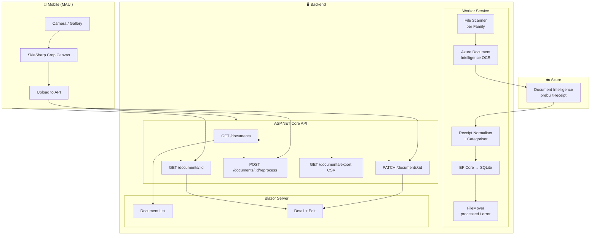
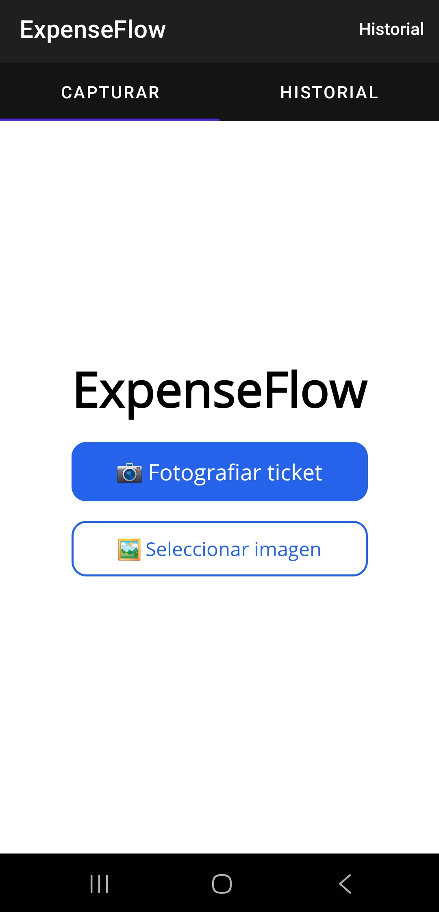
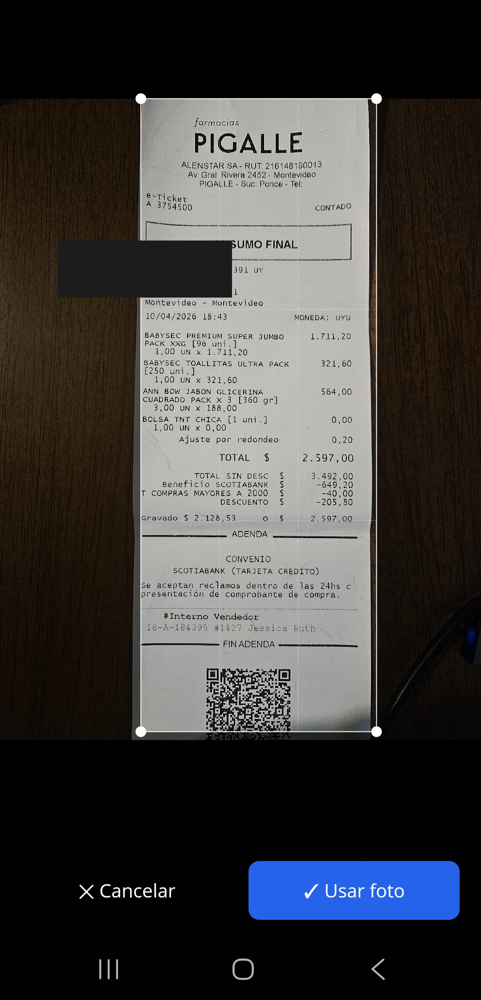
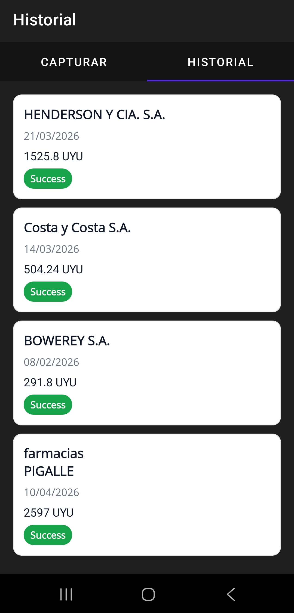
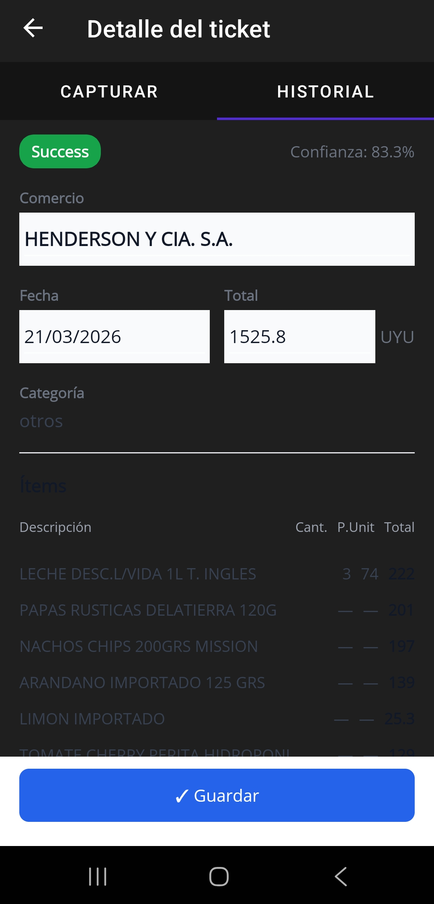

# ExpenseFlow

> **Receipt OCR pipeline + mobile app** — drop a photo, get a parsed expense record.

[](https://github.com/nandomadriaga/ExpenseFlow/actions/workflows/ci.yml)


ExpenseFlow is a full-stack expense management system. A background Worker watches an inbox folder, sends receipts through Azure Document Intelligence OCR, normalises the result, and persists structured data to SQLite. A REST API exposes the data to a Blazor Server web UI and a .NET MAUI mobile app — which can also snap and upload photos directly from a phone.

---

## Architecture



---

## Project structure

| Project | Layer | Responsibility |
|---|---|---|
| `ExpenseFlow.Domain` | Domain | Entities (`Document`, `DocumentLine`, `Family`, `FamilyMember`), domain rules |
| `ExpenseFlow.Application` | Application | Use-case interfaces, DTOs, `IReceiptOcrProvider`, `IFileMover`, `IFileScanner` |
| `ExpenseFlow.Infrastructure` | Infrastructure | EF Core `DbContext`, migrations, Azure OCR adapter, `FileMover`, `FileScanner`, mapper |
| `ExpenseFlow.Worker` | Host | `BackgroundService` — 60 s polling loop with overlap guard, Serilog file sink, .NET metrics |
| `ExpenseFlow.Api` | Host | ASP.NET Core minimal API — documents CRUD, reprocess, CSV export |
| `ExpenseFlow.Web` | Host | Blazor Server — paginated list, detail + edit form |
| `ExpenseFlow.Mobile` | Client | .NET MAUI — camera capture, SkiaSharp crop canvas, history + detail screens |

---

## Tech stack

| Technology | Used for | Why |
|---|---|---|
| **.NET 9 / C# 13** | All layers | Single language end-to-end, top-of-class async & records |
| **Azure Document Intelligence** | OCR | `prebuilt-receipt` model handles merchant, date, amounts, line items out-of-the-box |
| **EF Core 9 + SQLite** | Persistence | Zero-infrastructure database; migrations keep schema in sync automatically |
| **ASP.NET Core Minimal API** | REST layer | Low-ceremony endpoints with OpenAPI support |
| **Blazor Server** | Web UI | C# on the server, no JS build toolchain, real-time-ready |
| **.NET MAUI** | Mobile | One codebase → Android + iOS + Windows; native camera & file APIs |
| **SkiaSharp** | Crop canvas | Cross-platform GPU-accelerated 2-D drawing; touch events without platform-specific code |
| **Serilog** | Structured logging | Daily rolling file sink + console scopes with `JobId` correlation |
| **.NET Meters API** | Metrics | `files.found / processed_ok / processed_failed` counters via `dotnet-counters` |
| **Plugin.LocalNotification** | Push (mobile) | Native Android/iOS notifications when OCR completes, without a push server |

---

## Key features

**OCR pipeline**
- Watches one or more family inbox folders; detects `jpg`, `jpeg`, `png`, `pdf` files.
- SHA-256 hash deduplication — re-uploading the same file is a no-op.
- Azure Document Intelligence `prebuilt-receipt` → structured `Document` + `DocumentLine` rows.
- Exponential-backoff retry for transient Azure failures (configurable 0–20 retries).
- Confidence score stored per document; used to surface low-quality extractions.
- Raw JSON response stored so re-mapping is possible without re-calling Azure.

**Worker reliability**
- `SemaphoreSlim` overlap guard — a slow cycle is logged and skipped, never double-run.
- Each batch tagged with a `JobId` scope for end-to-end log tracing.
- Files that fail the pipeline land in `error/yyyy/MM/`; reprocess moves them back to inbox.

**Mobile app**
- Camera capture → SkiaSharp crop canvas with touch-drag handles.
- EXIF orientation auto-correction (`SKCodec` + canvas rotation) — Samsung S23 portrait shots work correctly.
- History screen with 30 s live polling and status badges (Success / Pending / Failed).
- Detail screen: edit merchant, date, amount; one-tap reprocess for failed tickets.
- Local push notification (Android & iOS) when OCR finishes.

**API & Web**
- Paginated document list with `from`, `to`, `status`, `category`, `familyId` filters.
- `PATCH /documents/{id}` — partial update of business fields.
- `POST /documents/{id}/reprocess` — restores file from error folder and re-queues.
- `GET /documents/export` — UTF-8 CSV with comma or semicolon delimiter.
- Expense splitting: `POST /documents/{id}/split` with per-member percentage breakdown.
- Member balance report: `GET /members/{id}/balance` filtered by date range.

---

## Getting started

### Prerequisites

- [.NET 9 SDK](https://dotnet.microsoft.com/download)
- `dotnet-ef` tool: `dotnet tool install --global dotnet-ef`
- An [Azure Document Intelligence](https://azure.microsoft.com/products/ai-services/ai-document-intelligence) resource (Free tier works for testing)

### 1 — Clone

```bash
git clone https://github.com/<you>/ExpenseFlow.git
cd ExpenseFlow
```

### 2 — Configure secrets

```bash
dotnet user-secrets init --project src/ExpenseFlow.Worker
dotnet user-secrets set "AzureDocumentIntelligence:Endpoint" "https://<resource>.cognitiveservices.azure.com/" --project src/ExpenseFlow.Worker
dotnet user-secrets set "AzureDocumentIntelligence:ApiKey"   "<your-key>"                                    --project src/ExpenseFlow.Worker
```

### 3 — Create the database

```bash
dotnet ef database update --project src/ExpenseFlow.Infrastructure --startup-project src/ExpenseFlow.Worker
```

### 4 — Create inbox folders

```bash
mkdir -p storage/familia/inbox storage/familia/processed storage/familia/error
```

### 5 — Run

```bash
# Terminal 1 — background Worker (OCR pipeline)
dotnet run --project src/ExpenseFlow.Worker

# Terminal 2 — REST API
dotnet run --project src/ExpenseFlow.Api

# Terminal 3 — Blazor web UI (optional)
dotnet run --project src/ExpenseFlow.Web
```

Drop a receipt photo into `storage/familia/inbox/` and watch the Worker process it. The document appears immediately in the API and Blazor UI, and as a push notification on the mobile app.

For the mobile app, set `ExpenseFlow:ApiBaseUrl` in `src/ExpenseFlow.Mobile/appsettings.json` to your machine's LAN IP and deploy to a device or emulator.

---

## Docker (one-command demo)

```bash
cp .env.example .env
# Edit .env with your Azure Document Intelligence endpoint and key
docker compose up --build
```

The API is available at **http://localhost:8080**. Drop receipt images into `./storage/inbox/` on your host machine and the Worker will pick them up automatically.

| Container | Image base | What it does |
|---|---|---|
| `expenseflow-api` | `mcr.microsoft.com/dotnet/aspnet:9.0` | Serves the REST API on port 8080 |
| `expenseflow-worker` | `mcr.microsoft.com/dotnet/aspnet:9.0` | Polls inbox, calls Azure OCR, writes to SQLite |

Both containers share a named Docker volume for the SQLite database. The `./storage/` folder on your host is bind-mounted into the Worker so you can drop files without going inside the container.

---

## Configuration reference

| Variable | Required | Default | Description |
|---|---|---|---|
| `ConnectionStrings__ExpenseFlow` | ✅ | `../../data/expenseflow.db` | SQLite path relative to Worker `ContentRoot` |
| `AzureDocumentIntelligence__Endpoint` | ✅ (prod) | placeholder | Azure resource URL |
| `AzureDocumentIntelligence__ApiKey` | ✅ (prod) | placeholder | Azure API key — use secrets, never commit |
| `AzureDocumentIntelligence__MaxRetries` | ❌ | `3` | Retry count for transient OCR failures (0–20) |
| `AzureDocumentIntelligence__BaseDelaySeconds` | ❌ | `1` | Base seconds for exponential backoff |
| `Worker__IntervalSeconds` | ✅ | `60` | Poll interval in seconds |
| `Storage__Inbox` | ✅ | `storage/familia/inbox` | Default inbox path |
| `Storage__Processed` | ✅ | `storage/familia/processed` | Processed files root |
| `Storage__Error` | ✅ | `storage/familia/error` | Failed files root |

Environment variables use `__` as separator (e.g. `AzureDocumentIntelligence__ApiKey`).

---

## API endpoints

| Method | Path | Description |
|---|---|---|
| `GET` | `/documents` | Paginated list — filters: `page`, `pageSize`, `from`, `to`, `status`, `category`, `familyId` |
| `GET` | `/documents/{id}` | Full detail with line items |
| `PATCH` | `/documents/{id}` | Edit merchant name, transaction date, total amount |
| `POST` | `/documents/{id}/reprocess` | Re-queue for OCR (moves file back to inbox) |
| `POST` | `/documents/{id}/split` | Record expense split with per-member percentages |
| `GET` | `/members/{id}/balance` | Member balance report filtered by date range |
| `GET` | `/documents/export` | Download CSV (comma or semicolon delimiter) |

---

## Tests

```bash
dotnet test ExpenseFlow.sln
```

| Test project | What's covered |
|---|---|
| `ExpenseFlow.IntegrationTests` | Full Worker pipeline (SQLite in-process), `FileScanner`, `FileMover`, OCR mapper, duplicate hash detection, reprocess flow, CSV export, member balance |
| `ExpenseFlow.Application.Tests` | Receipt normaliser unit tests, category rules engine |

---

## Design decisions

**Clean Architecture with explicit layer boundaries** — Domain has zero external dependencies. Application defines contracts. Infrastructure implements them. Hosts wire everything. This makes the OCR provider, file system, and database all swappable by replacing one adapter.

**Worker decoupling from API** — The Worker and API share only the SQLite database. The Worker has no HTTP surface; the API is read/write only, never triggers OCR. This means each process can be scaled, restarted, or deployed independently.

**Raw JSON storage** — Azure's full JSON response is persisted alongside the parsed fields. When a mapper bug is found (like the PascalCase regression in this project), documents can be re-mapped from stored data without re-calling Azure and incurring cost.

**SkiaSharp for the crop canvas** — MAUI's built-in drawing APIs are too limited for touch-driven interactive crop handles. SkiaSharp gives pixel-level control and runs identically on Android, iOS, and Windows from a single implementation.

**EXIF orientation handling** — `SKBitmap.Decode()` silently strips EXIF metadata, returning rotated pixels. The fix uses `SKCodec.Create()` to read `EncodedOrigin` before decoding, then applies a canvas rotation transform. This is the correct approach for any SkiaSharp image pipeline that accepts camera input.

---

## Screenshots

<p align="center">
  
  
  
  
</p>

<p align="center">
  <em>Captura · Recorte · Historial · Detalle</em>
</p>

---

## Known limitations & next steps

- **No authentication** — the API and Web UI are open. Adding ASP.NET Core Identity or Azure AD B2C is the natural next step.
- **Local SQLite only** — production would benefit from Azure SQL or Postgres with a proper connection pool.
- **iOS push notifications** — `Plugin.LocalNotification` is conditionally compiled; a real device + APNs certificate is needed to verify.
- **Blazor UI styling** — functional but unstyled; a Tailwind or MudBlazor pass would make it presentable.
- **Azure Blob Storage** — current design uses the local filesystem; Blob Storage would make the Worker stateless and cloud-deployable.

---

## License

MIT © Fernando Madriaga
